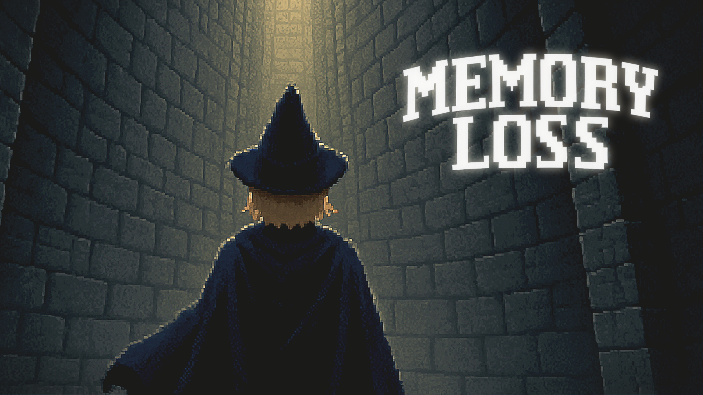
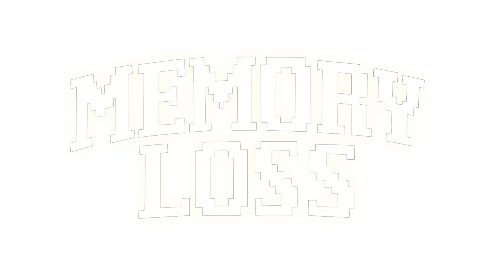

# Memory Loss

> 기억과 망각을 반복하는 마법사, 랜덤으로 드랍되는 주문서를 활용해 10층의 던전을 돌파하는 탑뷰 턴제 정통 로그라이크

- **장르:** 로그라이크, 액션 RPG

- **최신 빌드:**
  - Google Drive: https://drive.google.com/file/d/1mE-7XvKCkEg3p0iTHhXeOOTA-2eCUcfA/view?usp=drive_link

---

## 게임 특징

- 턴제 로그라이크: 플레이어 → 적이 번갈아 행동.

- 주문서 시스템: 전투/유틸 주문서가 맵에 랜덤 드랍. 각 주문서는 망각까지 남은 사용 턴이 정해져 있어, 제한 안에서만 사용 가능.

- 목표: 층마다 정해진 처치 수 요건을 달성하고 생존 → 다음 층으로 이동.

- 맵 프리셋 11종 + 10층 보스전 전용 맵.

- 콘셉트: 기억 ↔ 망각, 상태이상/유틸 주문으로 다양한 공략 루트.

---

## 조작법

| 동작        | 키보드/마우스        |
|-----------|----------------|
| 이동        | 마우스            |
| 주문서 사용    | 숫자키 1\~9, 마우스  |
| 주문서 사용 취소 | 숫차키 1\~9 다시 클릭 |

---

## 게임 진행

1. 층 입장 → 제한 턴 수 확인

2. 맵 곳곳의 주문서를 습득해 인벤토리에 저장

3. 몬스터 N마리 처치 조건을 채워 다음 층으로 이동

5. 총 10층 클리어 시 탈출 성공(10층은 보스전)

> 1번 슬롯은 ‘노멀어택’ 고정 — 주문서가 없을 때도 기본 생존이 가능하도록 설계.

## 주문서

| 이름                    | 속성   | 개요                                  |
|-----------------------|------|-------------------------------------|
| 불의 주문서                | 불    | 불 속성 공격 주문서                         |
| 물의 주문서                | 물    | 물 속성 공격 주문서                         |
| 얼음의 주문서               | 얼음   | 얼음 속성 공격 주문서                        |
| 화염 강와의 주문서            | 불    | 일정 턴 동안 불 속성 주문서의 데미지 증가            |
| 젖음 강화의 주문서            | 물    | 일정 턴 동안 물 속성 주문서의 데미지 증가            |
| 빙결 강화의 주문서            | 얼음   | 일정 턴 동안 얼음 속성 주문서의 데미지 증가           |
| 회상의 주문서               | 불    | 사용시 인벤토리 내 모든 주문서의 망각까지의 턴수를 일정량 회복 |
| 생명의 주문서               | 유틸   | 플레이어 전체 HP의 10% 회복 |
| 망각의 주문서               | 유틸   | 한 턴간 플레이어 행동 횟수 + 1 |
| 왜곡의 주문서               | 유틸   | 사용시 가장 최근에 망각한 주문서를 1회 부활 |
| 인내의 주문서               | 유틸   | 사용시 3턴간 보호막 체력 +30 부여 |

- 주문서마다 남은 사용 턴 수가 있어, 표시 턴 내에만 소모 가능

- 툴팁: 인벤토리에서 마우스 오버 시 설명 노출

- 1번 슬롯은 기본 공격 고정

## 몬스터
| 이름/계열    | 패턴      | 특이사항                                  |
|----------|---------|---------------------------------------|
| 슬라임      | 근접 추격   | 기믹 없음, 시야 범위 추적                       |
| 공허       | 원거리 공격  | 플레이어 자동 추적, 슬라임보다 긴 사거리, 인벤토리 봉인      |
| 후회       | 반사      | 공격 없음, 플레이어의 데미지 반사                   |
| 고독       | 상태이상    | 플레이어 행동을 복사, 반대 행동                    |
| 불안       | 투명화 | 피격 시 투명화                              |
| **자기혐오(보스)** | 다수 패턴   | 일정 페이즈 진입 시 플레이어에 고정 피해, 2가지 추가 스킬 패턴 |

## 팀 Memory Loss

- 안세은(팀장), 김경훈, 김대현, 조윤빈, 우채민
- CAU 2025 CIEN Tutorial Project 5조
- 구성원 :
  - 안세은 (팀장, 프로젝트 총괄, 기획 총괄 / 기획, 그래픽)
  - 김경훈 (개발 총괄 / 개발)
  - 김대현 (맵 기획, 백엔드 / 기획, 개발)
  - 조윤빈 (몬스터 기획 / 기획)
  - 우채민 (프론트 / 개발)

## 정보
- 개발 기간 : 2025년 7월 - 2025년 8월 (약 2개월)
- 개발 도구 : Unity 6000.0.48f1, C#
- 플랫폼 : Windows
- 플레이어 수 : 1인

